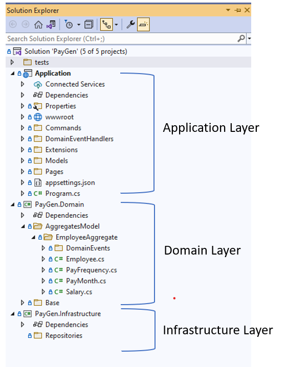

# Pay Gen


PayGen is a .NET App that generates an Employee's monthly pay slip. This is an assignment for Datacom recruitment.

### Architecture

PayGen is built with the idea of Domain Driven Design. We try to separate the complicated business logic into domain models (Aggregate, Entities, Value Object) and publish domain events for integration among other bounded contexts.
[Domain Driven Design](https://martinfowler.com/bliki/DomainDrivenDesign.html)

### Project Structure
- Domain Layer 
	- This is the heart of the application. All other layers depend on this, where domain experts and engineers define the business process, behaviors, and rules. 
	- This layer is persistent ignorant and independent of other layer
- Application Layer
	- This layer is mainly for web applications defining presentation logic. This layer depends on the Domain layer as a dependency.
- Infrastructure Layer
	- The Infrastructure layer defines the persistence technology and interactions with external applications. 
	- This application is empty as there is no such need for persistence as of now. However, having this layer in the first place defines a specific place to separate this responsibility for future implementation.



## Installation
- Clone `https://github.com/jatin-bhatt/PayGen.git`
- Checkout main branch
- Open the `PayGen.sln` solution.
- Build

## Configuration
- The Tax Slab config is set to use default (as suggested in the problem statement). If needed to change, set the Tax Slab configuration in the `appsettings.json` file accordingly
```javascript
"TaxSlab": [
    {
      "StartRange": 0,
      "EndRange": 14000,
      "Rate": 0.105
    },
    {
      "StartRange": 14000,
      "EndRange": 48000,
      "Rate": 0.175
    },
    ...
],
	
```

## Usage
- Run using IIS 
- or IISExpress (hit ctrl + F5). It will open the PayGen User Interface on localhost port 5157 `http://localhost:5157/`


## Assumptions

- Month selection is considered for the current year. However, the application design supports the selection for the previous and next year's months, in case there is a need.
- Tax Slabs are considered dynamic (e.g. Income Tax Department releases an order to change the slab for the next financial year) Hence, the values are kept in appsettings.json.
- Super is a part of the deduction.
- Authentication/Authorization is ignored.
- Persistence logic is ignored. Therefore, the Infrastructure layer is empty.
- Input Validations
	- First Name: Length 50, Required Field
	- Last Name: Length 50, Required Field
	- Annual Salary: Number Greater than 0, Required Field
	- SuperRate: Decimal Value between 0 and 50 (inclusive)
	- PayPeriod: Month Value
